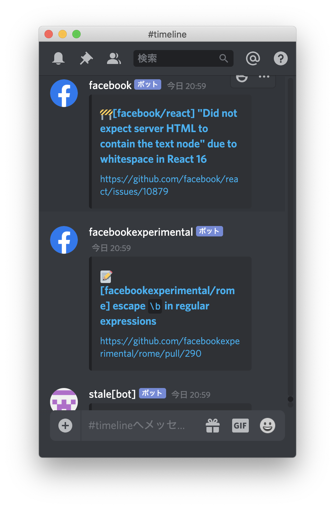

# MyDiscord

It is just Discord wrapper app with [nativefier](https://github.com/jiahaog/nativefier).

This app aim to view specific channel of Discord.

## Feature

- Hide every things except timeline!

## Installation

    yarn install

## Usage

You should create `url` file that is written your Discord channel url.
It is first view of the app

    echo "https://discordapp.com/channels/xxx/xxxx" > url
    yarn run build

Build command output `MyDiscord-<os>-<arch>` dir and you can open the built app.

    open MyDiscord-darwin-x64/MyDiscord.app

## Contributing

1. Fork it!
2. Create your feature branch: `git checkout -b my-new-feature`
3. Commit your changes: `git commit -am 'Add some feature'`
4. Push to the branch: `git push origin my-new-feature`
5. Submit a pull request :D

## License

MIT